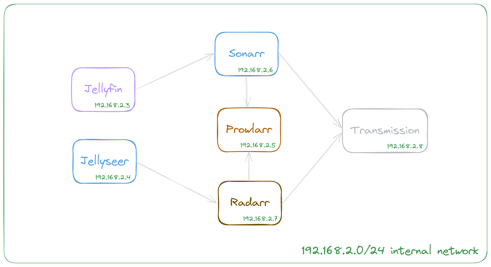
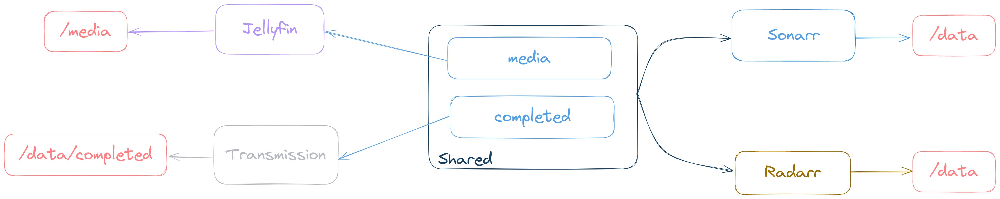

# Media server

## About the project

Recording special moments with my partner, birthday videos, activities, pet moments, or just beautiful times together is something I cherish. However, today's high-resolution videos can take up several megabytes or even gigabytes, making it inconvenient to download or transfer them without a strong internet connection or massive storage space.

I often found myself needing to share videos recorded on my phone with my girlfriend, which sparked the idea for this project. I wanted to create a media server where we could store and easily access our shared moments.

What started as a simple project to facilitate video sharing eventually evolved into an automated media consumption system. And so, the media server project grew into what it is today.

## Technologies used

- [Docker compose](https://docs.docker.com/compose/)
- [Jellyfin](https://jellyfin.org/)
- [Jellyseer](https://github.com/Fallenbagel/jellyseerr)
- [Sonarr](https://sonarr.tv/)
- [Radarr](https://radarr.video/)
- [Prowlarr](https://prowlarr.com/)
- [Transmission](https://transmissionbt.com/)

## How they communicate

    

## How do media directory work

    

